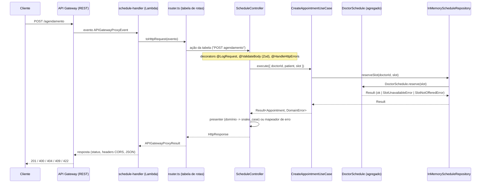

# API de Agendamento Médico — Teste Técnico (Leve Saúde)

API serverless (AWS Lambda + API Gateway REST) para listar agendas médicas, criar agendamentos e
sugerir uma especialidade a partir de sintomas (triagem com LLM). Dados mockados em memória, sem
banco. TypeScript estrito, Serverless Framework v3, Zod para validação e Jest para testes.

## Endpoints

| Método | Rota           | Sucesso | Erros                        |
| ------ | -------------- | ------- | ----------------------------- |
| GET    | `/agendas`     | 200     | 500                            |
| POST   | `/agendamento` | 201     | 400, 404, 409, 422, 500        |
| POST   | `/triagem`     | 200     | 400, 502, 503, 504, 500        |

Rotas mantidas exatamente como no enunciado: `/agendas` (plural) e `/agendamento` (singular). Numa
API nova, o padrão seria `/agendamentos` para ambas.

## Pré-requisitos

- Node.js >= 20 (o `.nvmrc` do repositório fixa `20`; se usa `nvm`, rode `nvm use`). O runtime da
  Lambda é `nodejs20.x` — o Serverless Framework v3.40 não aceita `nodejs22.x`, por isso o projeto
  não usa Node 22 apesar de ser a versão LTS mais recente (D18, [ADR-001](docs/adr/001-stack-e-versoes.md)).
- npm (vem com o Node).
- AWS CLI e credenciais configuradas — necessário **só** para o passo de deploy (seção
  [Deploy na AWS](#deploy-na-aws)). Não é preciso para rodar local nem para os testes.

## Rodar localmente

```bash
npm ci
cp .env.example .env
npm run dev
```

O servidor sobe em `http://localhost:3000`, sem prefixo de stage (`serverless-offline` com
`noPrependStageInUrl`).

O `.env.example` já vem com `TRIAGE_PROVIDER=fake`: com esse valor, `POST /triagem` responde por
palavras-chave, de forma determinística, sem chamar nenhum provedor de LLM e sem precisar de
`ANTHROPIC_API_KEY`. É o suficiente para rodar os três comandos acima direto, sem configurar nada.

Para usar o modelo real (Anthropic Claude), edite o `.env`:

```bash
TRIAGE_PROVIDER=anthropic
ANTHROPIC_API_KEY=sk-ant-...
```

e reinicie `npm run dev`. Sem `ANTHROPIC_API_KEY` (ou com ela vazia) e `TRIAGE_PROVIDER=anthropic`,
`POST /triagem` responde 503 de propósito (D17) — `GET /agendas` e `POST /agendamento` continuam
funcionando normalmente, porque o estado inválido é só da triagem.

## Exemplos cURL

Todas as respostas abaixo foram coletadas rodando `npm run dev` de verdade e chamando os endpoints
com `curl`, na ordem em que aparecem (o estado é em memória — ver [Decisões
importantes](#decisões-importantes) — então repetir os comandos numa ordem diferente pode mudar o
resultado, por exemplo se o horário do 201 abaixo já tiver sido reservado).

### `GET /agendas` — 200

```bash
curl -i http://localhost:3000/agendas
```

```
HTTP/1.1 200 OK
content-type: application/json; charset=utf-8

{"medicos":[{"id":1,"nome":"Dr. João Silva","especialidade":"Cardiologista","horarios_disponiveis":["2026-06-10 09:00","2026-06-10 10:00","2026-06-10 11:00"]},{"id":2,"nome":"Dra. Maria Souza","especialidade":"Dermatologista","horarios_disponiveis":["2026-06-11 14:00","2026-06-11 15:00"]},{"id":3,"nome":"Dra. Ana Pereira","especialidade":"Pediatra","horarios_disponiveis":["2026-06-12 08:00","2026-06-12 09:00","2026-06-12 10:00"]},{"id":4,"nome":"Dr. Ricardo Lima","especialidade":"Ortopedista","horarios_disponiveis":["2026-06-15 13:00","2026-06-15 14:00"]},{"id":5,"nome":"Dra. Fernanda Costa","especialidade":"Clínico Geral","horarios_disponiveis":["2026-06-16 08:00","2026-06-16 09:00","2026-06-16 10:00"]}]}
```

### `POST /agendamento` — 201 (sucesso)

```bash
curl -i -X POST http://localhost:3000/agendamento \
  -H "Content-Type: application/json" \
  -d '{"agendamento":{"medico_id":1,"paciente":"Carlos Almeida","data_horario":"2026-06-10 09:00"}}'
```

```
HTTP/1.1 201 Created
content-type: application/json; charset=utf-8

{"mensagem":"Agendamento realizado com sucesso","agendamento":{"id":"ba38bf2a-b046-476a-9b92-2463adc63325","medico":"Dr. João Silva","paciente":"Carlos Almeida","data_horario":"2026-06-10 09:00"}}
```

Depois desse agendamento, o horário `2026-06-10 09:00` some de `horarios_disponiveis` do médico 1
no `GET /agendas` (D6).

### `POST /agendamento` — 409 (horário já reservado)

Repetindo exatamente o mesmo `medico_id` e `data_horario` do 201 acima:

```bash
curl -i -X POST http://localhost:3000/agendamento \
  -H "Content-Type: application/json" \
  -d '{"agendamento":{"medico_id":1,"paciente":"Carlos Almeida","data_horario":"2026-06-10 09:00"}}'
```

```
HTTP/1.1 409 Conflict
content-type: application/json; charset=utf-8

{"erro":"Horário indisponível","mensagem":"O horário solicitado não está mais disponível para este médico."}
```

### `POST /agendamento` — 400 (payload inválido)

```bash
curl -i -X POST http://localhost:3000/agendamento \
  -H "Content-Type: application/json" \
  -d '{"agendamento":{"medico_id":1,"paciente":"Ca","data_horario":"2026-06-10 09:00"}}'
```

```
HTTP/1.1 400 Bad Request
content-type: application/json; charset=utf-8

{"erro":"Payload inválido","mensagem":"O corpo da requisição é inválido. Verifique os detalhes.","detalhes":[{"campo":"agendamento.paciente","problema":"deve ter pelo menos 3 caracteres"}]}
```

### `POST /agendamento` — 404 (médico inexistente)

```bash
curl -i -X POST http://localhost:3000/agendamento \
  -H "Content-Type: application/json" \
  -d '{"agendamento":{"medico_id":999,"paciente":"Carlos Almeida","data_horario":"2026-06-10 09:00"}}'
```

```
HTTP/1.1 404 Not Found
content-type: application/json; charset=utf-8

{"erro":"Médico não encontrado","mensagem":"O médico informado não existe."}
```

### `POST /agendamento` — 422 (horário nunca ofertado)

`2026-06-10 12:00` não está na agenda do médico 1 (que só tem 09:00, 10:00 e 11:00):

```bash
curl -i -X POST http://localhost:3000/agendamento \
  -H "Content-Type: application/json" \
  -d '{"agendamento":{"medico_id":1,"paciente":"Carlos Almeida","data_horario":"2026-06-10 12:00"}}'
```

```
HTTP/1.1 422 Unprocessable Entity
content-type: application/json; charset=utf-8

{"erro":"Horário não ofertado","mensagem":"O horário solicitado não faz parte da agenda deste médico."}
```

### `POST /triagem` — 200 (`TRIAGE_PROVIDER=fake`, padrão do `.env.example`)

```bash
curl -i -X POST http://localhost:3000/triagem \
  -H "Content-Type: application/json" \
  -d '{"sintomas":"Estou com dor no peito forte, falta de ar e formigamento no braço esquerdo há 20 minutos."}'
```

```
HTTP/1.1 200 OK
content-type: application/json; charset=utf-8

{"especialidade_sugerida":"Cardiologista","urgencia":"emergencia","justificativa":"Procure imediatamente um pronto-socorro ou ligue 192 (SAMU). O relato traz sinal de alerta que exige atendimento imediato.","medicos_disponiveis":[{"id":1,"nome":"Dr. João Silva","proximo_horario":"2026-06-10 10:00"}],"aviso":"Esta é uma sugestão automatizada e não substitui avaliação médica. Em caso de emergência, ligue 192."}
```

`proximo_horario` já reflete o `09:00` reservado no exemplo anterior — é o próximo horário livre do
médico 1, não simplesmente o primeiro do seed (D26).

### `POST /triagem` — 400 (sintomas muito curtos)

```bash
curl -i -X POST http://localhost:3000/triagem \
  -H "Content-Type: application/json" \
  -d '{"sintomas":"dor"}'
```

```
HTTP/1.1 400 Bad Request
content-type: application/json; charset=utf-8

{"erro":"Payload inválido","mensagem":"O corpo da requisição é inválido. Verifique os detalhes.","detalhes":[{"campo":"sintomas","problema":"deve ter pelo menos 10 caracteres"}]}
```

### `POST /triagem` — 503 (`TRIAGE_PROVIDER=anthropic` sem `ANTHROPIC_API_KEY`)

Servidor reiniciado com essas variáveis (sem editar o `.env`):

```bash
TRIAGE_PROVIDER=anthropic ANTHROPIC_API_KEY= npm run dev
```

```bash
curl -i -X POST http://localhost:3000/triagem \
  -H "Content-Type: application/json" \
  -d '{"sintomas":"Estou com dor no peito forte, falta de ar e formigamento no braço esquerdo há 20 minutos."}'
```

```
HTTP/1.1 503 Service Unavailable
content-type: application/json; charset=utf-8

{"erro":"Triagem indisponível","mensagem":"O serviço de triagem está temporariamente indisponível. Tente novamente mais tarde. Em caso de emergência, ligue 192."}
```

`GET /agendas` e `POST /agendamento` continuam respondendo normalmente nesse mesmo servidor — a
falta de chave derruba só a triagem (D17, [ADR-009](docs/adr/009-triagem-na-funcao-schedule.md)).

## Testes e qualidade

| Comando                   | O que roda                                                                                          |
| -------------------------- | ----------------------------------------------------------------------------------------------------- |
| `npm test`                 | Unitários (`src/**/*.spec.ts`) + integração (`tests/integration`)                                     |
| `npm run test:unit`        | Só unitários: entidades, value objects, casos de uso, repositórios em memória, decorators, presenters |
| `npm run test:integration` | Handler `schedule` com eventos `APIGatewayProxyEvent` fabricados, status e corpo exatos do contrato   |
| `npm run test:e2e`         | Suíte e2e (`tests/e2e`); ainda vazia neste repositório (Fase 6 do `docs/plano.md`, não concluída)     |
| `npm run test:coverage`    | Unitários + integração com cobertura; threshold de 90% linhas/branches em `src/domain` e `src/application` |
| `npm run lint`             | ESLint (`typescript-eslint` strict), zero warnings tolerados                                          |
| `npm run typecheck`        | `tsc --noEmit`, modo strict                                                                            |
| `npm run format:check`     | Prettier em modo verificação                                                                          |
| `npm run check`            | Os quatro anteriores em sequência (typecheck → lint → format:check → test:coverage); roda antes de todo commit |

Os testes de integração não fazem chamada de rede real e não usam `jest.mock` para dependências de
negócio: usam fakes que implementam as portas (`tests/helpers/fakes`), o que prova a inversão de
dependência.

## Arquitetura

```
src/
  domain/               # entidades, value objects, erros de domínio — zero dependências externas
    entities/            # Doctor, Appointment, DoctorSchedule (agregado com a regra 409/422)
    value-objects/       # SlotDateTime, Specialty, Urgency
    errors/               # DomainError abstrato + erros com `code` literal
  application/           # casos de uso e portas — não conhece HTTP, AWS, Zod nem SDK de LLM
    ports/                # ScheduleRepository, AppointmentRepository, IdGenerator, Logger, TriageModel
    use-cases/            # ListSchedulesUseCase, CreateAppointmentUseCase, SuggestSpecialtyUseCase
    errors/               # erros da dependência de triagem (502/503/504), estendem DomainError
  infrastructure/         # implementações concretas das portas
    repositories/          # InMemoryScheduleRepository (reserveSlot atômico), InMemoryAppointmentRepository
    mocks/                  # seed dos médicos (doctors.seed.ts) + fábrica do agregado
    id-generator/           # CryptoIdGenerator (crypto.randomUUID)
    logger/                 # JsonLogger + stdoutWriter
    llm/                    # AnthropicTriageModel, FakeTriageModel, UnavailableTriageModel
      prompts/               # triage.prompt.v1.ts (prompt versionado)
  interfaces/http/        # tradução HTTP <-> casos de uso
    handlers/               # schedule-handler.ts (entrypoint Lambda) + schedule-handler.factory.ts (tabela de rotas)
    controllers/            # ScheduleController, TriageController
    decorators/             # @ValidateBody, @HandleHttpErrors, @LogRequest
    schemas/                # Zod (create-appointment, triage) — fonte da verdade dos payloads
    presenters/             # domínio -> contrato snake_case
    errors/                 # mapeamento DomainError -> status HTTP (switch exaustivo)
    router.ts               # roteador por tabela "<método> <resource>" -> ação do controller
  shared/                  # Result<T, E>, assertNever — sem lógica de negócio
  main/                    # composition root
    container.ts            # createContainer(): monta o grafo de dependências, uma vez por container Lambda
    env.schema.ts            # validação Zod das variáveis de ambiente da triagem
    triage-model.factory.ts  # escolhe TriageModel a partir do provider configurado
tests/
  helpers/                 # builders, fábrica de evento API Gateway, fakes das portas
  integration/              # handler completo com evento fabricado
  e2e/                      # vazio nesta entrega (ver Próximos passos)
```

As dependências apontam sempre para dentro: `interfaces → application → domain`; `infrastructure`
implementa as portas definidas em `application`; `main` é o único lugar que conhece tudo e monta o
grafo de dependências por injeção via construtor (composition root em `src/main/container.ts`,
função `createContainer`). Casos de uso nunca fazem `new` de infraestrutura — recebem portas.

Fluxo de uma requisição (`POST /agendamento` como exemplo; `GET /agendas` e `POST /triagem` seguem
o mesmo caminho, trocando o controller e o caso de uso):



ADRs (decisões arquiteturais detalhadas, em `docs/adr/`):

- [001 — Stack e versões das ferramentas](docs/adr/001-stack-e-versoes.md)
- [002 — Erros de negócio como `Result`, não exceções](docs/adr/002-result-vs-excecoes.md)
- [003 — 422 para horário nunca ofertado, 409 para horário ocupado](docs/adr/003-422-vs-409-horario-nao-ofertado.md)
- [004 — Portas de repositório, reserva atômica e entrada do caso de uso](docs/adr/004-portas-de-repositorio-e-reserva-atomica.md)
- [005 — Infraestrutura em memória (seed, repositórios e logger)](docs/adr/005-infraestrutura-em-memoria.md)
- [006 — Idioma do código e do contrato HTTP](docs/adr/006-idioma-do-codigo-e-do-contrato.md)
- [007 — Decorators TS 5 na camada HTTP e entrega tipada do corpo validado](docs/adr/007-decorators-http-e-corpo-tipado.md)
- [008 — Uma função Lambda `schedule` com roteamento por tabela e composition root por módulo](docs/adr/008-funcao-schedule-unica-e-composition-root.md)
- [009 — `POST /triagem` na função `schedule`](docs/adr/009-triagem-na-funcao-schedule.md)
- [010 — Triagem com LLM: porta, erros tipados, retentativas e orçamento de tempo](docs/adr/010-triagem-porta-falhas-e-retentativas.md)
- [011 — Modelo e prompt da triagem](docs/adr/011-modelo-e-prompt-da-triagem.md)

## Decisões importantes

Resumo das decisões de `docs/requisitos.md` (tabela "Decisões sobre ambiguidades", D1–D28) mais
relevantes para quem vai avaliar ou rodar o projeto. O texto completo, com motivo de cada uma, está
lá.

- **Estado em memória por container Lambda (D7).** Não há banco: `InMemoryScheduleRepository` e
  `InMemoryAppointmentRepository` guardam tudo em memória, dentro do módulo `src/main/container.ts`,
  reaproveitado entre invocações do **mesmo** container/processo. Isso implica uma limitação real:
  containers diferentes da mesma função (ou instâncias diferentes de `npm run dev`) não compartilham
  estado. Em produção, o requisito seria persistência externa (ver [Próximos
  passos](#próximos-passos)).
- **Por que `GET /agendas`, `POST /agendamento` e `POST /triagem` vivem na mesma função Lambda
  `schedule` (D15).** É consequência direta do ponto acima: Lambdas distintas nunca compartilham
  memória (cada uma tem seus próprios containers na AWS, e localmente o serverless-esbuild gera um
  bundle por função). Se `POST /agendamento` estivesse numa função e `GET /agendas` noutra, o
  horário reservado não sumiria da listagem (D6). A triagem entrou depois nessa mesma função pelo
  mesmo motivo: `medicos_disponiveis` (contrato 3) precisa cruzar a sugestão com horários realmente
  livres, incluindo os já reservados por `POST /agendamento`. Ver
  [ADR-008](docs/adr/008-funcao-schedule-unica-e-composition-root.md) e
  [ADR-009](docs/adr/009-triagem-na-funcao-schedule.md). O roteamento dentro da função é por uma
  tabela declarativa `"<método> <resource>" -> ação`, não por `if`/`switch` de negócio no handler.
  A alternativa de produção seria uma função por endpoint, com a agenda num banco compartilhado
  (DynamoDB com `ConditionExpression` para a reserva atômica, ver Próximos passos).
- **Rotas mantidas do enunciado (D1).** `/agendas` (plural) e `/agendamento` (singular), mesmo sendo
  inconsistente — é o contrato dado pelo avaliador.
- **Formato de erro sempre o mesmo (D9).** Toda resposta de erro é
  `{ "erro": string, "mensagem": string, "detalhes"?: [{ "campo": string, "problema": string }] }`,
  inclusive erros do próprio API Gateway (rota inexistente, 403 etc.) fora da Lambda, via
  `GatewayResponses` no `serverless.yml` (D19). 500 sempre com mensagem genérica, sem stack trace.
  O `serverless-offline` **não** emula `GatewayResponses`: localmente, uma rota inexistente devolve
  o 404 próprio do `serverless-offline`, fora desse formato — só na AWS o 404 sai no formato do
  contrato.
- **404 vs. 422 vs. 409 no agendamento (D4, D20).** Médico inexistente é 404 (detectado no
  repositório, ao localizar o agregado). Horário que nunca esteve na agenda do médico é 422 (regra
  pura no agregado `DoctorSchedule.reserve`). Horário que existiu mas já foi reservado é 409 (mesma
  regra, resultado diferente). Ver [ADR-003](docs/adr/003-422-vs-409-horario-nao-ofertado.md).

## Triagem com IA

`POST /triagem` (diferencial do enunciado) separa claramente regra de negócio e chamada ao modelo:

- **Porta** `TriageModel` (`src/application/ports/triage-model.port.ts`): `classify(...)` recebe os
  sintomas e a lista de especialidades permitidas e devolve um `Result` tipado. O caso de uso
  (`SuggestSpecialtyUseCase`, `src/application/use-cases/suggest-specialty.use-case.ts`) não conhece
  SDK, prompt nem HTTP — só a porta. É ele quem cruza a sugestão do modelo com a agenda em memória
  para montar `medicos_disponiveis` (D26) e quem aplica o texto fixo de emergência (D25).
- **Adapters** em `src/infrastructure/llm/`: `AnthropicTriageModel` (chama a API da Anthropic via
  `@anthropic-ai/sdk`, com timeout, retentativa e validação Zod da saída — ver
  [ADR-010](docs/adr/010-triagem-porta-falhas-e-retentativas.md)), `FakeTriageModel` (classificação
  por palavras-chave, determinística, sem rede — usada quando `TRIAGE_PROVIDER=fake`) e
  `UnavailableTriageModel` (provider `anthropic` configurado sem `ANTHROPIC_API_KEY`: sempre
  503). `src/main/triage-model.factory.ts` escolhe a implementação a partir de
  `TRIAGE_PROVIDER`/`TRIAGE_MODEL` (validados em `src/main/env.schema.ts`); o caso de uso não muda
  quando entra um provedor novo.
- **Prompt versionado**: `src/infrastructure/llm/prompts/triage.prompt.v1.ts`, com saída estruturada
  via tool use forçado (`tool_choice` obrigando a ferramenta `submit_triage`) e mitigação de prompt
  injection (relato do paciente escapado e isolado numa tag `<sintomas>`, D27). Detalhes da
  qualidade do prompt e da escolha do modelo em
  [ADR-011](docs/adr/011-modelo-e-prompt-da-triagem.md).
- **Erros tipados** (`src/application/errors/`): `TriageUnavailableError` → 503 (sem chave, provedor
  indisponível ou rejeitando a chamada), `TriageInvalidResponseError` → 502 (saída do modelo inválida
  mesmo após retentativa), `TriageTimeoutError` → 504. O detalhe interno do provedor nunca vaza na
  resposta ao cliente.

## Deploy na AWS

Não há script `deploy` no `package.json` — o comando é direto do Serverless Framework.

1. Configure credenciais AWS (`aws configure` ou variáveis `AWS_ACCESS_KEY_ID` /
   `AWS_SECRET_ACCESS_KEY` / `AWS_SESSION_TOKEN`) com permissão para criar os recursos (Lambda, API
   Gateway, IAM, CloudFormation).
2. Defina a chave da triagem no ambiente de quem faz o deploy (nunca no `.env` copiado do
   `.env.example`, que usa `TRIAGE_PROVIDER=fake` — o `serverless.yml` tem `useDotenv: true` e
   levaria o `fake` para a AWS):

   ```bash
   export TRIAGE_PROVIDER=anthropic
   export ANTHROPIC_API_KEY=sk-ant-...
   ```

3. Deploy:

   ```bash
   npx serverless deploy
   ```

   Isso empacota (`serverless-esbuild`) e publica a stack `levesaude-agendamento` na região
   `sa-east-1`, stage `dev` por padrão (`--stage <nome>` para outro stage). Em produção, a chave
   deveria vir do SSM Parameter Store ou do Secrets Manager, lida só pela função de triagem — hoje
   ela é uma variável de ambiente em texto na função inteira (ver Próximos passos e
   [ADR-009](docs/adr/009-triagem-na-funcao-schedule.md)).
4. Para conferir o pacote sem publicar nada (o que este projeto valida no CI/checagem local):

   ```bash
   npx serverless package
   ```

5. Para remover tudo que foi criado:

   ```bash
   npx serverless remove
   ```
